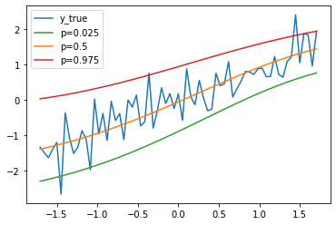

# Spatiotemporal Analysis

The analysis in this repo uses uncertainty quantification feature that we have developed in [torchTS](https://github.com/Rose-STL-Lab/torchTS).

Example output:

We make inference with `[0.05, 0.5, 0.95]` confidence levels.


## Getting Started

1. Create a virtual environment

```bash
python3 -m venv venv
```

2. Activate the virtual environment

```bash
source venv/bin/activate # for mac
```

3. Install dependencies

```bash
pip install -r requirements.txt
```

4. Train models and make predictions. This will generate a `conformal_prediction.png` plot in the root directory.

```bash
python run.py
```