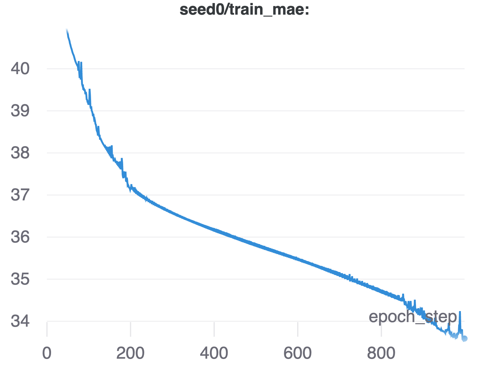
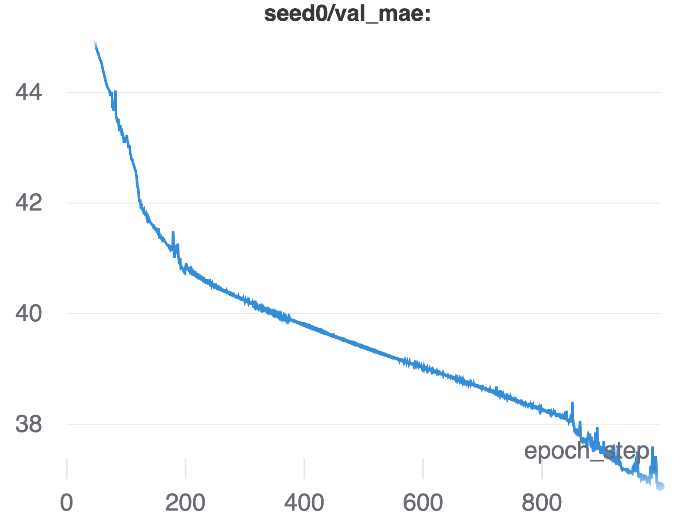
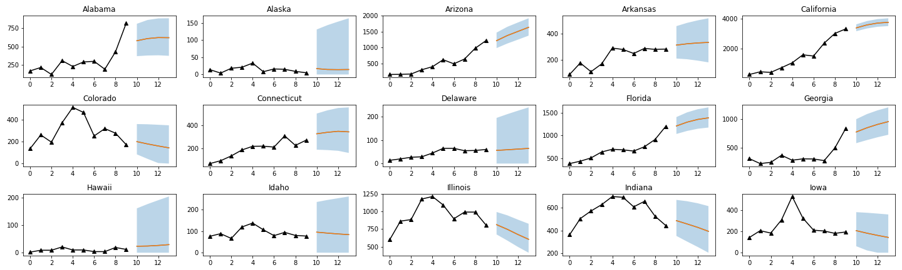
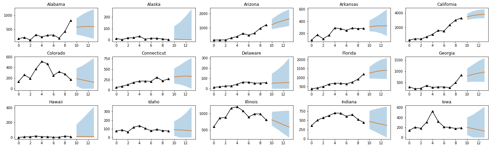
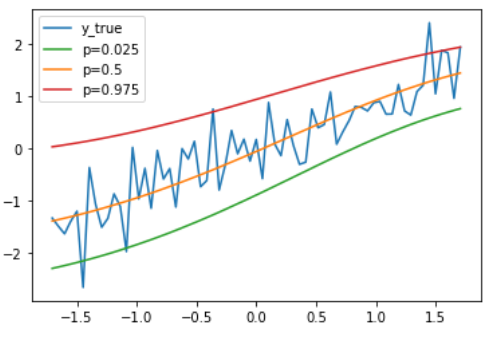

# Introduction

Our research for the first half of our two quarter long project focused on the task of implementing the extra informative parameter of uncertainty as an output of spatiotemporal models. Current models that factor both space and time into predictions don't provide the user with an idea of the ways the model training can produce varying predictions even when based on the same data.
In order to provide this benefit, we investigated multiple implementations of measuring uncertainty in which we could build upon an existing spatiotemporal Python library to leverage it’s existing models with our added uncertainty quantity.

In the second half of our project, we directed our focus towards the task of advancing quantile regression using the conformal prediction technique, which provides uncertainty quantification while gives us a better guarantee that our range of predictions were correctly covering the observed variability when tuning our model. 

We also looked into implementing a data loader class in order to help split and format training, calibration, and test datasets for our predictive models.

Lastly, we worked on revamping the existing torchTS library API documentation in order to provide more detail in the documentation of specific Python functions within the library.

# Background and Motivation

The motivation of evaluating and learning uncertainty quantification methods from various papers in this project is to enable an uncertainty quantification feature in torchTS, which is a PyTorch-based python library for large-scale time-series forecasting created by Rose Yu's Spatiotemporal Machine Learning Lab. Enabling uncertainty quantification (i.e. prediction intervals) for machine learning / deep learning models can provide huge benefits to risk assessment, public health, finance, and so many more industries.

### Uncertainty Quantification and Spatiotemporal Analysis

The further development of Deep Neural Networks has led to their greater adoption within many domains for problem solving. In the past, neural networks could provide accurate predictions, yet were unable to provide a sense of uncertainty attached to those predictions. In order to best use these models, they need to not only make predictions but also quantify their predictions' certainty (uncertainty), which guides our intentions of researching implementations of uncertainty quantification.

For example, consider an automatic stock trading system where a machine learning model predicts the stock price. A point prediction from the model might be dramatically different from the real value because of the amount of unpredictability in the stock market. But, on the other hand, if the model could estimate the range in which it guarantees to cover the true value with high probability, the trading system could compute the best and worst rewards and make more sensible decisions.

We build upon the research performed in [Quantifying Uncertainty in Deep Spatiotemporal Forecasting](https://arxiv.org/abs/2105.11982) as an original reference to compare our code implementation’s performance.

### torchTS and User Friendliness

We also sought to contribute to the torchTS library by implementing a data loader class. This class had the intention of being designed to preprocess and split up data into training, calibration, and test sets in a more consistent format for our models to be more easily applied.

We also aimed to improve the torchTS library API documentation to present the library's functionality in an easily understood way as well as present users with examples of torchTS' spatiotemporal analysis methods being used. This would allow for sustainable growth of torchTS as users are better able to seek guidance on how to use the library efficiently.

### Conformal Quantile Regression

Conformal Quantile Regression is one version of uncertainty quantification using different foundational approaches producing different advantages and disadvantages that will help provide users with specialized models that may suit their needs more specifically.

[Conformalized Quantile Regression (Romano 2019)](https://arxiv.org/abs/1905.03222) proposed a conformal quantile regression model which aimed to combine the strengths of conformal prediction, which produces a confidence interval using finite samples, without making distributional assumptions, and quantile regression, which is more adaptive when predicting phenomena with more varying observations. They also proved the guarantee coverage on prediction using this strategy. In our work, we primarily adopt the model methodology from the above paper, and implement our code largely dependent on the [conformal example](https://github.com/yromano/cqr/blob/master/cqr_real_data_example.ipynb) Romano et al. provided.

# Evaluating Uncertainty Quantification Methodologies

During the first half of our project, we focused on looking into different implementations of uncertainty quantification. These different implementations provided us a with foundational understanding of uncertainty quantification, which would help aid us in implementing uncertainty quantification as an embedded feature of torchTS.

## General Characteristics of Various Uncertainty Quantification Approaches

## Quantile Regression

The first model we explored is quantile regression where we generate one confidence interval each time the model is trained. Training this model multiple times with different fixed confidence levels provides us with uncertainty quantification at our desired levels of confidence.

One potential issue using this model is that the prediction for different quantiles may cross each other if the amount of data the model is trained on is not large enough. In order to artificially increase the data we train this model on, we sample multiple different subsets of data from our training dataset.

## MIS Regression

The second model we investigated is Mean Interval Score (MIS) Regression. We run the model multiple times, each time updating our parameters according to a loss function that is mathematically the same as MIS, also known as Winkler loss.

Within our investigation, we fix our confidence level 95%, since if more than one confidence level were to be used the runtime complexity of computing MIS would be too large for a general use case in torchTS. 

This loss function is comprised of 3 sections. The first section produces a penalty the size of the distance between the upper and lower bounds of our predicted interval. The second section produces a penalty the size of the distance between the lower bound and the actual value which we scaled when the actual value is less than that of the lower bound. The third part produces a penalty the size of the distance between the actual value and the upper bound scaled when the actual value is higher than the predicted value. Since the loss function of MIS regression jointly includes the upper and lower bounds, the result outputs both, unlike quantile regression.

## SG-MCMC

The final model we examine is stochastic gradient Markov chain Monte Carlo (SG-MCMC). This form of gradient descent is useful in allowing us to calculate our quantiles according to subsets of the training data set which are selected based on the posterior distribution over the parameter space. Also, we follow the stochastic gradient thermostat method (SGNHT), whose purpose is to control gradient noise, which is typically characterized by heavy tails. 

## Quantile Regression Performance

We utilized a COVID-19 dataset, which provided us with historical COVID-19 death rates amongst various US states that we could use to perform a spatiotemporal analysis.

For the COVID-19 dataset, we chose to follow the methodology of not predicting the number of deaths, but instead forecasting the residual in order to have better accuracy.

For both models, we trained on our local computer, which was not CUDA-enabled and therefore utilized the CPU though our code can automatically utilize a CUDA-enabled GPU if available. The training time for the quantile model on our CPU is about 10 minutes and training time for the MIS regression model on our CPU is about 5 minutes.

We run our loss function with the quantile set (0.025, 0.5, 0.975), using a DCRNN model and a learning rate of $1e^{-2}$, and with a patience of 20. We evaluate our model also using the quantile loss function. The training curve for a selected seed is shown below. We noticed that the error converged after 1000 steps.

    

    

# Visualization

We use the residual between the reported death and the corresponding GLEAM
predictions to train the DeepGLEAM model, and we connect the residual with the death number to create the final visualization.

We picked the first 15 states from the United States in alphabetical order for comparison. For the Quantile regression model, we plot the results using an average of the 10 seeds as shown below.

a) Reproduced Quantile Regression Model

b) Original Paper Quantile Regression Model

## Comparison with the Original Paper:

By comparing with the original paper, we found out that our prediction from the trainings has the same overall shape as the original paper. However, our results appear to have a larger confidence interval. We hypothesize that this may be due to our insufficient training steps, and we will examine this by retraining using different patience.

## Implementation of Findings into Library

As part of our quarter 1 initiatives, we wanted to merge these uncertainty quantification methodologies into a usable suite of tools that focus on spatiotemporal analysis. TorchTS is a library built upon pytorch-lightning, a module that provides an organized framework for implementing custom models, which allows for it to provide specialized machine learning tools for spatiotemporal data.

In the first half, we worked on an extension to the torchTS codebase that implements a quantile loss function, which provides uncertainty information in our forecasts by bounding our forecasts with models trained on 25%, 50%, and 75% confidence levels. The predictions from the 50% confidence level trained model provides the conventional prediction, while the 25% and 75% confidence level predictions serve as under and over-estimates that are represented in the variation in our model performance amongst various retrainings.

# Conformal Quantile Regression

We are focused on implementing code in our library that is able to run on computers with processing power that is increasingly accessible to the general public and therefore we focused on *inductive conformal prediction (ICP)* during the second half of our project. ICP is a type of conformal prediction that invokes a regression function a finite number of times. In order to perform ICP, we are required to split our training dataset equally into two new datasets: training and calibration.

Once we obtain our new training dataset, we proceed to train our nonconformal predictor (NCP), in our case a quantile regressor, which trains a given model for an upper confidence bound (0.975 quantile), a median (0.5 quantile), and a lower confidence bound (0.025 quantile). These construct the confidence band that we will build on in our conformal quantile regressor. It is important to note that for this step, we have specified a fixed desired confidence level of 95%, which is where we get the range of (0.025, 0.975) for our confidence band.

Following the inital NCP training to obtain a confidence band, we perform the first step of the conformalization process. The conformalization process involves us using our new calibration set to update the NCP-predicted calibration bands to achieve enough coverage to satisfy a specified confidence level.
We begin by calculating the difference between the true $Y_i$ from our new calibration set and each of the upper and lower bands obtained through our NCP, which are the residuals of our model's predictions. For each entry of our calibration set, we select the smaller of the two residuals: the upper band residual, or the lower band residual. We then sort our selected residuals in descending order and find the residual where $1-\alpha$ of the values pertaining to each entry in our calibration set are larger than it.
We take this residual value, which we will call d, and use it to adjust our predicted NCP confidence bands by subtracting it from our former lower band, $L_{prev}$ and add it to our former upper band, $U_{prev}$ to obtain:

$L_{updated} = L_{prev} - d$

and
$U_{updated} = U_{prev} + d$

This split conformal process provides conformalization with the performance cost equivalent to fitting our NCP and provides us with aforementioned coverage guarantee.

Below we can see the resulting range of predictions from our conformal quantile regression implementation from a randomly generated dataset of an upwards trend line with noise.

# TorchTS' User Experience Enhancement

Users can now easily view the library's API documentation on the official website. We used Sphinx to auto-generate torchTS API documentation based on class and function docstrings with pytorch-theme. We also used Docusaurus V2 for easy generation of the torchTS official website. Then, we merged Sphinx into Docusaurus V2 so that users can view both torchTS tutorials and API docs on the official website. We implemented customized Github Action workflows such that every commit to the main branch will trigger a new build for the package and the official website, and thus, every PR merge will automatically update our API docs and tutorials. This is highlighted in [torchTS Pull Request #206](https://github.com/Rose-STL-Lab/torchTS/pull/206). 

Also, we had worked on completing foundational landing pages for our documentation such as a table of contents and a torchTS installation section so that users can quickly understand how to begin using this library.

# Future Work

An important aspect of maintaining and growing the torchTS library is to make it easy for others to contribute code to the repository. TorchTS is built with the intention of making spatiotemporal analysis more accessible and open. In order to do this, more descriptive docstrings and more guides on contributing would greatly improve the quality of users’ experiences. Additionally, as noted above there are many approaches to the same problem such as with uncertainty quantification. TorchTS would greatly benefit from the option of choosing from a variety of different model implementations, while maintaining the elegance of making methods simple and intuitive for the common user. We hope that the groundwork laid within documentation efforts and implementations of uncertainty quantification helps in guiding the project to becoming more widely utilized in the future.